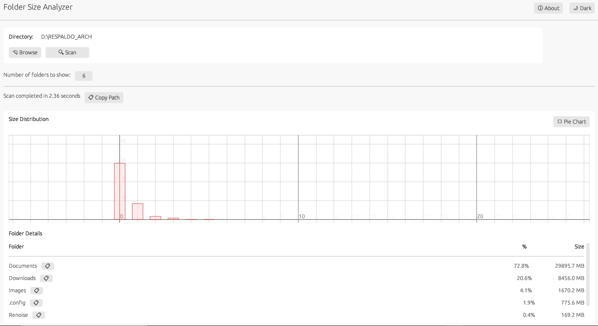
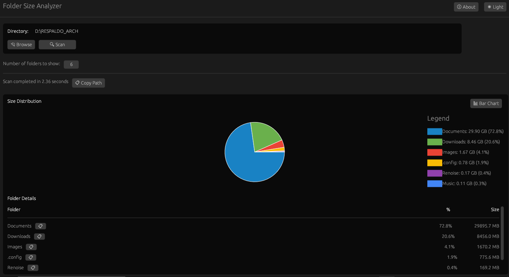
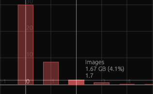
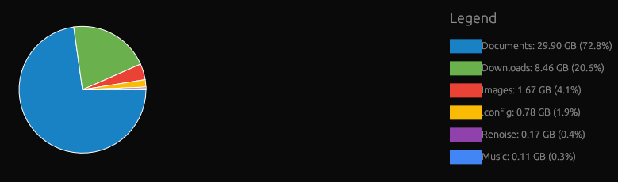

# Folder Size Analyzer

[](https://github.com/ivar-avello/folder-size-analyzer/blob/main/LICENSE)
[](https://www.rust-lang.org/)
[](https://github.com/emilk/egui)
[](https://github.com/ivar-avello/folder-size-analyzer/issues)

A Rust-based desktop application for analyzing and visualizing folder sizes, built with `eframe` and `egui`.

---

## Screenshots
- **Screenshot 1: Bar graph view with light theme**

- **Screenshot 2: Pie chart view with dark theme**

\

## Features
- **Directory Scanning**: Scan any directory to analyze its contents
\

- **Visualization**: View folder sizes as pie charts or bar graphs
\

- **Detailed Listing**: See folder sizes with percentage breakdowns
\
- **Clipboard Integration**: Copy folder paths to clipboard
\
- **Responsive UI**: Clean, modern interface with proper margins and containers that are going to keep improving for a smooth user experience (Pending)
\
- **Tooltips**: Helpful tooltips guide user interactions (Pending)
\

## Installation
1. Clone the repository:
   ```bash
   git clone https://github.com/yourusername/folder-size-analyzer.git
   ```
2. Navigate to the project directory:
   ```bash
   cd folder-size-analyzer
   ```
3. Build the project:
   ```bash
   cargo build --release
   ```
4. Run the application:
   ```bash
   cargo run --release
   ```

## Usage
1. Launch the application
2. Select a directory to analyze using the "Browse" button
3. Click "Scan" to start the analysis
4. View results in the visualization panel
5. Use the toolbar to:
   - Switch between chart types
   - Copy folder paths
   - Toggle dark/light mode

## Dependencies
- [eframe](https://github.com/emilk/egui/tree/master/crates/eframe): GUI framework
- [egui](https://github.com/emilk/egui): Immediate mode GUI
- [rayon](https://github.com/rayon-rs/rayon): Parallel processing
- [walkdir](https://github.com/BurntSushi/walkdir): Directory traversal
- [arboard](https://github.com/1Password/arboard): Clipboard integration

## Contributing
Contributions are welcome! Please follow these steps:
1. Fork the repository
2. Create a feature branch (`git checkout -b feature/AmazingFeature`)
3. Commit your changes (`git commit -m 'Add some AmazingFeature'`)
4. Push to the branch (`git push origin feature/AmazingFeature`)
5. Open a Pull Request

## License
Distributed under the MIT License. See `LICENSE` for more information.

## Contact
RRSS & Email - [@argos3dworld](https://twitter.com/argos3dworld) - ivar.avello@gmail.com

Project Link: [https://github.com/ivar-avello/folder-size-analyzer](https://github.com/ivar-avello/folder-size-analyzer)
